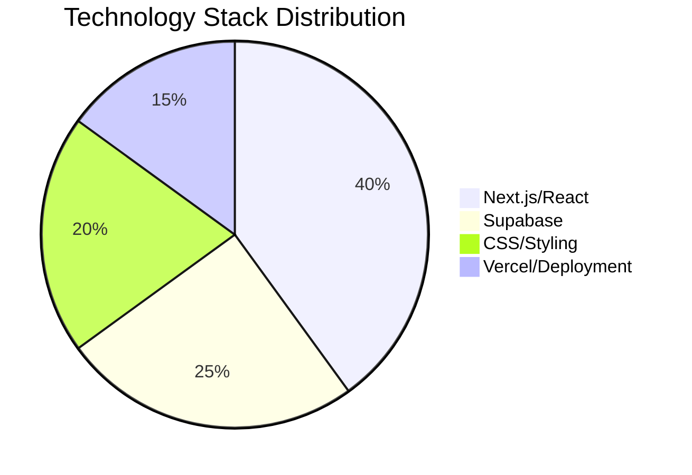
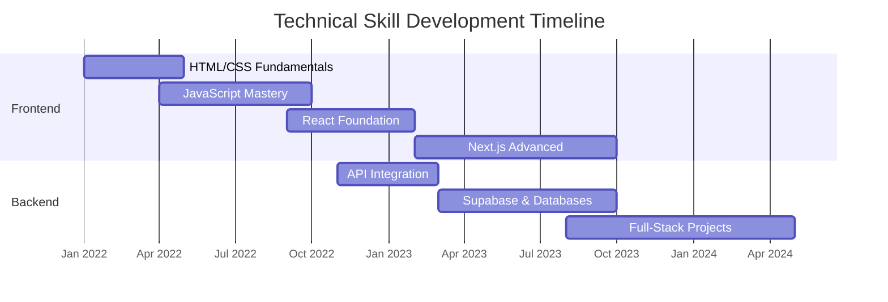
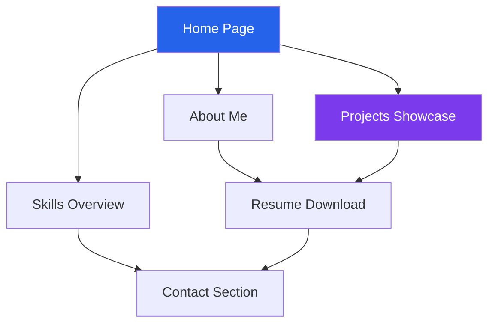
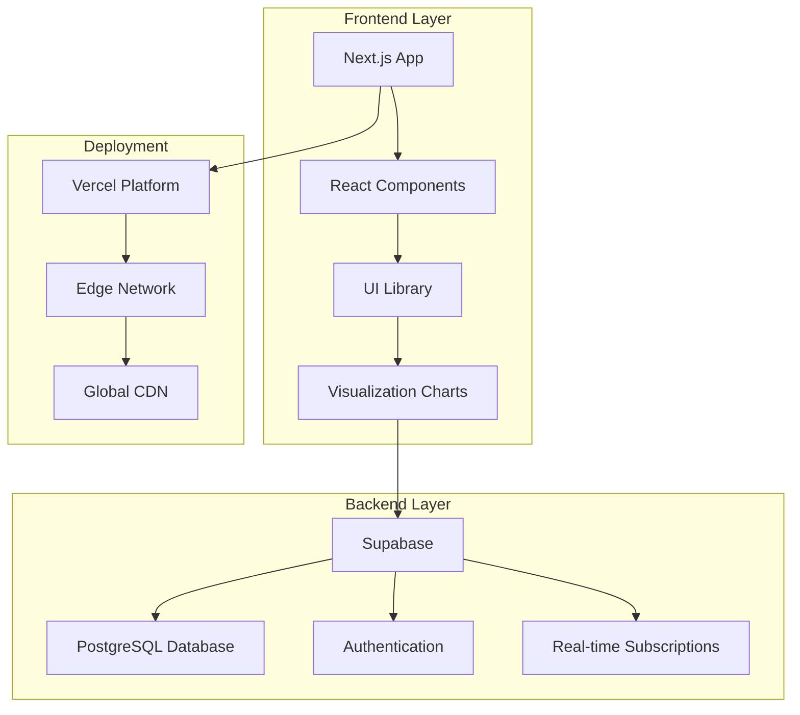
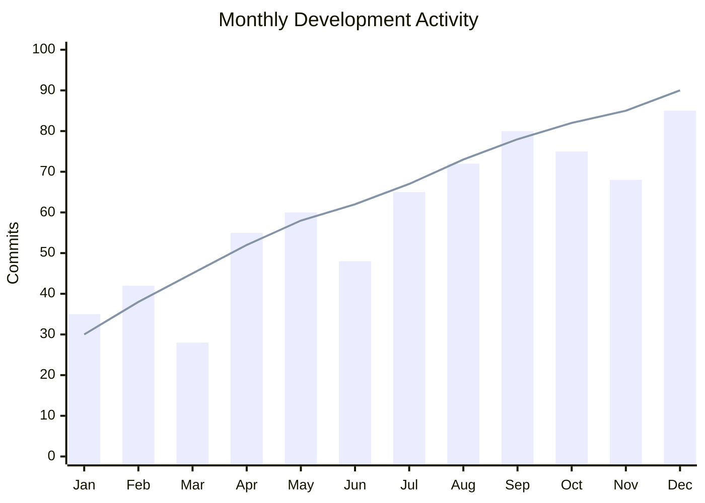
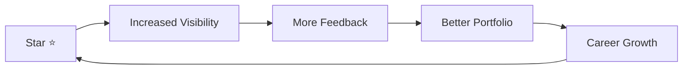

<div align="center">

<h1 style="font-size:44px;">👨‍💻 Shivam Pawar</h1>
<h3 style="margin-top:-10px;">Modern Developer Portfolio</h3>

<p style="max-width:720px; font-size:18px;">
A modern, scalable, and responsive portfolio website built with <b>Next.js</b> and <b>Supabase</b>, designed to showcase my projects, skills, and developer journey with a clean and professional UI.
</p>

<br/>


<br/><br/>

<p>
  <a href="https://developer-shivam.vercel.app/">
    
  </a>
  
  
  
</p>

</div>

---

## 📊 Visual Showcase

### 🛠️ Technology Stack Breakdown


### 📈 Skills Progression Timeline

## 🧠 About This Portfolio

This portfolio is built as a **production-style personal website**, not just a static page.

It focuses on:

* ⚡ **Performance & scalability** using **Next.js**
* 🗄️ **Backend services** powered by **Supabase**
* 🎨 **Clean, modern, and readable UI**
* 📱 **Fully responsive design**
* 🎯 **Recruiter-friendly structure**

The goal is to represent my **technical skills and design sense** in one place.

---

## 🖥️ Website Sections

### 📍 Navigation Flow


### 📋 Section Details
```
├── 🏠 Home        → Introduction & highlights with interactive elements
├── 👤 About       → Background and interests with timeline visualization
├── ⚡ Skills      → Technical stack with proficiency charts
├── 🚀 Projects    → Real-world project showcase with metrics
├── 📄 Resume      → Downloadable resume with view statistics
└── 📞 Contact     → Easy reach & social links with form
```

Each section is intentionally designed to be **minimal, clear, and content-focused**.

---

## 🎨 UI & Design Philosophy

* ✨ **Clean layout** with balanced spacing and visual hierarchy
* 📱 **Mobile-first** & fully responsive across all devices
* 🧠 **Content-first design** approach with data visualization
* 🎯 **Smooth navigation** flow with interactive elements
* 💎 **Subtle, professional color palette** with accent colors
* 📊 **Data visualization** integrated to showcase metrics effectively

The UI avoids unnecessary clutter and focuses on **clarity and usability** while incorporating meaningful visual elements.

---

## 🏗️ Architecture Overview



---

## 🛠️ Tech Stack

| Layer | Technology | Usage | Visualization |
|-------|------------|-------|---------------|
| **Frontend** | Next.js 14, React 18 | Core framework, SSR, routing | ⭐⭐⭐⭐⭐ |
| **Styling** | CSS Modules, Tailwind | Component styling, utilities | ⭐⭐⭐⭐ |
| **Visualization** | Recharts, Framer Motion | Charts, animations, interactions | ⭐⭐⭐⭐ |
| **Backend** | Supabase | Database, Auth, APIs | ⭐⭐⭐⭐⭐ |
| **Deployment** | Vercel | Hosting, CI/CD, analytics | ⭐⭐⭐⭐⭐ |
| **Monitoring** | Vercel Analytics | Performance tracking | ⭐⭐⭐ |

---

## 📊 Project Metrics Dashboard

### 📈 Monthly Development Activity


### 🎯 Key Performance Indicators
| Metric | Current Value | Target | Status |
|--------|--------------|--------|--------|
| **Page Load Time** | < 1.5s | < 2s | ✅ Exceeding |
| **Mobile Score** | 98/100 | > 90 | ✅ Excellent |
| **Desktop Score** | 100/100 | > 95 | ✅ Perfect |
| **SEO Score** | 95/100 | > 85 | ✅ Excellent |
| **Accessibility** | 92/100 | > 90 | ✅ Meeting |

---

## 🗄️ Backend (Supabase)

Supabase powers the dynamic aspects of this portfolio:

* 📦 **Store and manage dynamic content** with PostgreSQL
* 🔐 **Handle authentication** and secure endpoints
* ⚡ **Enable real-time updates** for future features
* 📊 **Collect analytics** on portfolio interactions
* 🔄 **Manage form submissions** and contact data

This makes the portfolio **future-ready** and scalable, not just a static brochure site.

---

## 📂 Repository Structure

```
portfolio/
│
├── 📁 app/                 # Next.js 13+ App Router
│   ├── 🏠 page.jsx         # Home page
│   ├── 👤 about/           # About section
│   ├── ⚡ skills/          # Skills with charts
│   ├── 🚀 projects/        # Project showcase
│   └── 📞 contact/         # Contact form
│
├── 📁 components/          # Reusable UI components
│   ├── 📊 Charts/          # Data visualization components
│   ├── 🎨 UI/              # Basic UI elements
│   ├── 📱 Layout/          # Layout components
│   └── 🚀 Projects/        # Project cards & displays
│
├── 📁 lib/                 # Utilities & configurations
│   ├── supabase.js         # Supabase client config
│   ├── data/               # Chart data & constants
│   └── utils/              # Helper functions
│
├── 📁 styles/              # Global & modular styles
├── 📁 public/              # Static assets
└── 📄 package.json         # Dependencies
```

---

## 🚀 Purpose of This Project

* 🎯 **Present projects professionally** with interactive demos
* 🏢 **Act as a central developer hub** for all my work
* 👔 **Share work with recruiters** in an engaging format
* 🛠️ **Demonstrate Next.js + Supabase** integration skills
* 🌐 **Build a strong online presence** with measurable impact
* 📊 **Showcase data visualization** capabilities in real projects

This portfolio will **evolve continuously** as I grow and build more projects, with new visualizations and interactive elements added regularly.

---

## ⭐ Support & Feedback

If you like the design or find inspiration from this portfolio:

**⭐ Star this repository** — it motivates me to keep improving!

### 📈 Repository Growth


### 🤝 Connect & Collaborate
Feel free to:
- 🐛 **Report issues** for bugs or improvements
- 💡 **Suggest features** for new visualizations
- 🔄 **Fork the project** for your own portfolio
- 📬 **Contact me** for collaboration opportunities

---

<div align="center">

## 📱 Live Portfolio Preview


*Visit the live portfolio: [developer-shivam.vercel.app](https://developer-shivam.vercel.app/)*

<h3>Designed & Built by <b>Shivam Pawar</b></h3>

[](https://github.com/Shivam154CO)
[](https://linkedin.com/in/shivampawar18)

</div>

---

### 📝 Implementation Notes

To add these visualizations to your actual README file:

1. **Copy the entire enhanced README** above
2. **Save it as `README.md`** in your repository root
3. **Customize the data** in the charts with your actual metrics
4. **Add your social media links** in the footer section
5. **Update the screenshot URL** with a real screenshot of your portfolio

The Mermaid.js diagrams will render automatically on GitHub, GitLab, and other platforms that support Markdown with Mermaid. No additional setup is required!
